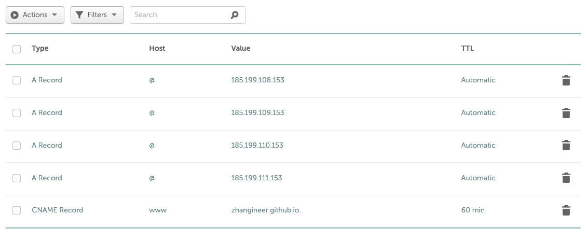

# Build blog using your own domain

1. Obtain a domain from any of the domain hosting services such as GoDaddy and Namecheap ( I used NameCheap )
2. Build a github page - which you can follow the instructions here: [Building a Free Blog with GitHub Pages in Minutes](https://chadbaldwin.net/2021/03/14/how-to-build-a-sql-blog.html) and if you prefer to start from the ground up [Build a Github Page](https://github.com/skills/github-pages)
3. Add your own domain name in Github Setting: [Add custom domain to Github page](https://docs.github.com/en/pages/configuring-a-custom-domain-for-your-github-pages-site/managing-a-custom-domain-for-your-github-pages-site)
4. Update the CNAME record (your current CNAME record probably points to a placeholder page from the domain vendor). [How to update CNAME for different domain vendor](https://knowledge.hubspot.com/domains-and-urls/update-your-dns-records#instructions-by-dns-provider)
5. Picking a theme from Github templates: [Github Supported Themes](https://pages.github.com/themes/)
6. Add DNS Record as shown below 